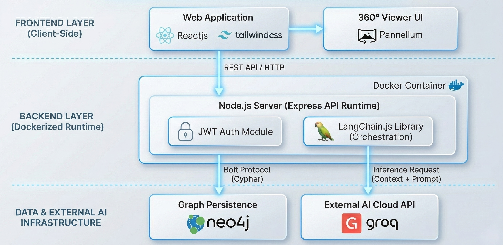

# ENSAM360 - Smart Campus Project 🎓🌐


**ENSAM360** is an immersive "Smart Campus" platform designed for the École Nationale Supérieure d'Arts et Métiers (ENSAM) in Meknès. It bridges the gap between the physical and digital worlds by offering a high-fidelity **Virtual Tour**, an intelligent **AI Guide**, and a mathematically optimal **Navigation System**.

---

## 🚀 Key Features

### 🌍 1. Immersive 360° Virtual Tour
- **High-Definition Panoramas:** Explore lecture halls, laboratories, and green spaces in full 360° VR.
- **Interactive Hotspots:** Navigate naturally between connected locations.
- **Powered by:** [Pannellum](https://pannellum.org/).

### 🗺️ 2. Interactive Navigation Engine
- **2D Vector Map:** A clickable, interactive SVG map of the entire campus.
- **Shortest Path Calculation:** Implements **Dijkstra's Algorithm** via Neo4j Graph Data Science library to find the optimal route.
- **Real-time Visualization:** Visualizes the path instantly on the 2D map.

 

### 🤖 3. The AI Brain (Chatbot)
- **Context-Aware:** Knows exactly where you are and guides you accordingly ("Turn left" vs "Go to Building B").
- **RAG Pipeline:** Uses Retrieval Augmented Generation to answer questions specific to ENSAM (Courses, Admin procedures).
- **Tech:** Powered by **Groq LPU** (Llama 3.3) and **LangChain**.

### 🛡️ 4. Administration & Security
- **Graph Management:** Admins can manage graph nodes and connections.
- **Secure Access:** Protected via **JWT** (JSON Web Tokens) and **OTP** email verification.

---

## 🛠️ Technology Stack

| Component | Technology | Description |
|-----------|------------|-------------|
| **Frontend** | React, Vite, TailwindCSS | Fast, responsive SPA with modern UI/UX. |
| **Backend** | Node.js, Express | RESTful API orchestrating services. |
| **Database** | Neo4j (Graph DB) | Native graph storage for optimal pathfinding ($O(1)$ hops). |
| **AI / ML** | Groq, LangChain | High-speed inference for the Chatbot. |
| **DevOps** | Docker, Docker Compose | Containerized environment for consistent deployment. |

---

## 🏗️ Architecture

The project follows a **Micro-Services** inspired architecture within a Monorepo:



---

## 🚀 Getting Started

### Prerequisites
- [Docker Desktop](https://www.docker.com/products/docker-desktop/) installed and running.
- [Git](https://git-scm.com/) installed.

### 1. Clone the Repository
```bash
git clone https://github.com/your-username/ENSAM360.git
cd ENSAM360
```

### 2. Environment Configuration
Create a `.env` file in the `backend/` directory with the following keys:

```env
# Backend Configuration (backend/.env)
PORT=5000

# Neo4j Database (AuraDB or Local)
NEO4J_URI=neo4j+s://your-db-instance.databases.neo4j.io
NEO4J_USERNAME=neo4j
NEO4J_PASSWORD=your-password

# AI / Chatbot
GROQ_API_KEY=gsk_...
HUGGINGFACE_API_KEY=hf_...

# Security (JWT & Email)
JWT_SECRET=your_super_secret_key
EMAIL_USER=your-email@gmail.com
EMAIL_PASS=your-email-app-password
```

### 3. Run with Docker 🐳 (Recommended)
You can launch the entire stack (Frontend + Backend) with a single command:

```bash
docker compose up --build
```
- **Frontend:** Access at `http://localhost:5173`
- **Backend:** Access at `http://localhost:5000`

---

## 📂 Project Structure

```bash
ENSAM360/
├── backend/                # Node.js API
│   ├── api/
│   │   ├── controllers/    # Request logic
│   │   ├── services/       # Business logic (Map, Chatbot, Auth)
│   │   └── routes/         # API Endpoints
│   ├── config/             # DB & Env setup
│   └── scripts/            # Database Seeding scripts
├── frontend/               # React Application
│   ├── src/
│   │   ├── components/     # Reusable UI (Map, Chatbot, Tour)
│   │   ├── pages/          # App Pages
│   │   └── context/        # Global State (Auth)
├── docs/                   # Documentation & Report
└── docker-compose.yml      # Container Orchestration
```

---

## 👨‍💻 Authors

- **Khalil Ait Nouisse**
- **Omar Bouhlal**

---

## 📄 License
This project is an **Initiation Project** for academic purposes.
